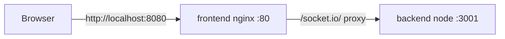
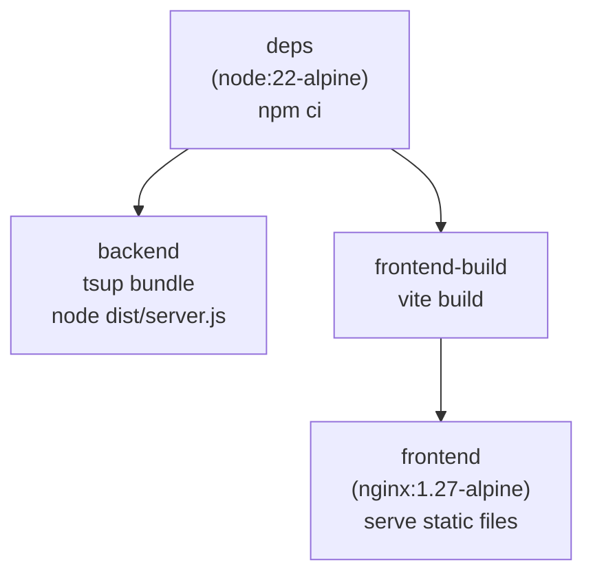

# Docker Setup

This document explains how the project runs inside Docker and what each piece does.

## Overview

The repo is an npm-workspaces monorepo with three packages:

| Package | Purpose |
| --- | --- |
| `@life/shared` | Types, constants, grid/color helpers, and patterns used by both apps |
| `@life/backend` | Node.js + Socket.IO game server (bundled with tsup, run with Node) |
| `@life/frontend` | React + Vite client (built to static files, served by nginx) |

A single `docker compose up --build` builds and starts everything.

## Quick start

```bash
docker compose up --build
```

Then open <http://localhost:8080>.

Stop everything with:

```bash
docker compose down
```

To rebuild after code changes:

```bash
docker compose up --build
```

To tail logs while running:

```bash
docker compose logs -f backend
docker compose logs -f frontend
```

## Files involved

| File | What it does |
| --- | --- |
| `Dockerfile` | Multi-stage build with shared targets for backend and frontend |
| `docker-compose.yml` | Defines the `backend` and `frontend` services |
| `packages/frontend/nginx.conf` | Serves the built app and proxies Socket.IO traffic to the backend |
| `.dockerignore` | Keeps `node_modules`, `dist`, `.git`, etc. out of the build context |

## What happens on `docker compose up --build`

1. Compose reads `docker-compose.yml` and sees two services, both built from the repo root (`context: .`) but with different `target`s in the `Dockerfile`.
2. The `deps` stage runs once and is shared by both services: it installs the npm workspaces from `package-lock.json`.
3. The **backend** target copies the server/shared source, bundles it with tsup, and produces an image that runs the server with Node.
4. The **frontend** target copies all sources, runs `vite build`, and copies the static output into an nginx image.
5. Compose creates a private Docker network, starts `backend`, then starts `frontend`.
6. nginx serves the app on host port `8080` and proxies `/socket.io/` requests to `backend:3001` on the private network.



## The Dockerfile

The `Dockerfile` uses a single dependency stage and then splits into the two services.



### Why multi-stage builds?

A multi-stage build separates **building** from **running**:

- The build stages contain the full toolchain (TypeScript, Vite, tsx, all dev dependencies).
- The final `frontend` stage is just nginx with static files — no Node toolchain at all.
- The final `backend` stage inherits `node_modules` from `deps` because it needs `socket.io` at runtime, but it still reuses one shared install.

The result is smaller final images and better layer caching than a single "install everything, build, run" image.

### Stage 1: `deps`

- Copies the root `package.json` and `package-lock.json`.
- Copies each workspace's `package.json` (`backend`, `frontend`, `shared`).
- Runs `npm ci` so the install is cached unless dependencies change.

**Why copy the manifests before the source?**

Docker caches each `COPY`/`RUN` instruction as a layer. If we copied all source first, then ran `npm ci`, every code change would invalidate the cache and trigger a full re-install. By copying only `package.json`/`package-lock.json` first, the expensive `npm ci` layer is reused unless the dependency files themselves change.

**Why `npm ci` instead of `npm install`?**

`npm ci` deletes `node_modules` and installs exactly what `package-lock.json` specifies. It's deterministic — ideal for reproducible Docker builds — and faster than `npm install` in clean environments.

### Stage 2: `backend`

- Copies the `backend` and `shared` source into the image.
- Builds shared first, then bundles the backend with tsup:

  ```text
  npm run build --workspace @life/shared
  npm run build --workspace @life/backend
  ```

  The backend build runs `tsc --noEmit` (typecheck) followed by `tsup`, which bundles `src/server.ts` and the `@life/shared` source into a single runnable `dist/server.js`. `socket.io` stays external and is loaded from `node_modules` at runtime.

- Runs the compiled output with Node:

  ```text
  node packages/backend/dist/server.js
  ```

- Exposes port `3001`.

> **Why bundle instead of running `tsc` output or `tsx`?**
> Plain `tsc` emits extensionless ESM imports that Node rejects, and `@life/shared` points at TypeScript source. tsup resolves both at build time into runnable JS, so the production container doesn't need `tsx`.

### Stage 3: `frontend-build`

- Copies all package sources.
- Runs `npm run build --workspace @life/frontend`, which produces static assets in `packages/frontend/dist`.

### Stage 4: `frontend`

- Starts from `nginx:1.27-alpine`.
- Copies the built static assets into nginx's web root.
- Copies `nginx.conf` as the server config.
- Exposes port `80`.

## Why these base images?

### `node:22-alpine`

- **Node 22** is an active LTS release, giving a stable runtime for `npm ci`, the tsup/Vite builds, and the `socket.io` server.
- **Alpine** is a minimal Linux distribution (~5 MB base instead of hundreds of MB for Debian-based images). It keeps builds and images small.
- Pinning the major version (`22`) keeps builds reproducible; the exact patch is resolved at build time from the image registry.

### `nginx:1.27-alpine`

We serve the built frontend with **nginx rather than a Node dev/preview server** because:

- The production bundle is just static HTML/CSS/JS; nginx serves those files very efficiently.
- nginx also acts as a **reverse proxy** for `/socket.io/`, forwarding both HTTP polling and WebSocket connections to the backend. This lets the browser connect to a single origin (`localhost:8080`).
- It's a tiny image (~40 MB) compared to running a full Node runtime just to serve files.
- `1.27` is a modern stable line, and `-alpine` keeps the footprint minimal. Pinning the minor version (`1.27`) makes builds predictable.

## docker-compose.yml


### `backend` service

- Built from the `backend` target of the `Dockerfile`.
- Runs with `NODE_ENV=production` and `PORT=3001`.
- **Not published to the host.** It only needs to be reachable from the frontend container on the shared Docker network. Keeping it unpublished reduces the attack surface.
- `restart: unless-stopped` automatically restarts it if it crashes (but not if you stop it manually).

### `frontend` service

- Built from the `frontend` target of the `Dockerfile`.
- Publishes container port `80` to host port `8080`, so the app is available at <http://localhost:8080>.
- `depends_on: backend` ensures the backend starts first.

  > `depends_on` only controls **start order**, not readiness. If the backend is still booting, Socket.IO will simply keep retrying on the client until it connects.

## nginx.conf

The nginx config does two jobs:

1. **Serves the single-page app**

   ```nginx
   location / {
       try_files $uri $uri/ /index.html;
   }
   ```

   Any unknown route falls back to `index.html`. This is required for client-side routing so a hard refresh on a nested path still loads the app.

2. **Proxies Socket.IO to the backend**

   ```nginx
   location /socket.io/ {
       proxy_pass http://backend:3001;
       proxy_http_version 1.1;
       proxy_set_header Upgrade $http_upgrade;
       proxy_set_header Connection "upgrade";
       ...
   }
   ```

   Socket.IO first tries a WebSocket connection. WebSockets are an HTTP/1.1 upgrade, so nginx must:

   - forward `Upgrade` and `Connection` headers, and
   - keep the connection upgraded (`proxy_http_version 1.1`).

   Without those headers the connection would fall back to HTTP long-polling (still functional, but slower). This setup also means the browser connects to the same origin (`localhost:8080`) instead of talking to the backend directly.

## .dockerignore

Excludes everything that shouldn't be copied into the build context:

- `.git`, `docs`, `*.log`, `.DS_Store` — not needed for building
- `node_modules` — the image installs its own copy
- `**/dist` — the image builds its own artifacts
- `**/*.tsbuildinfo` — stale TypeScript composite build state can confuse `tsc`

A lean build context makes `COPY` faster and avoids accidentally baking local machine artifacts into the image.

## Ports

| Port | Where | Purpose |
| --- | --- | --- |
| `8080` | host → frontend container `80` | The app users open in a browser |
| `3001` | backend container (internal only) | Game/Socket.IO server |

## Common tasks

```bash
# Build images without starting containers
docker compose build

# Start in the background
docker compose up -d

# Rebuild and restart (after dependency changes)
docker compose up --build

# See running containers
docker compose ps

# Follow logs
docker compose logs -f

# Stop and remove containers
docker compose down

# Remove containers, network, and built images
docker compose down --rmi local
```

## Troubleshooting

**Port `8080` is already in use**

Change the host port in `docker-compose.yml`:

```yaml
ports:
  - "3000:80"
```

**`npm ci` fails with a lockfile error**

The `package-lock.json` is out of sync with `package.json`. Run locally:

```bash
npm install
```

and commit the updated lockfile.

**The app loads but the status badge never connects**

Check the backend logs and the Socket.IO proxy:

```bash
docker compose logs -f backend
curl "http://localhost:8080/socket.io/?EIO=4&transport=polling"
```

A successful response starts with `0{"sid":...}`.

**Rebuild after changing `package.json` or `nginx.conf`**

```bash
docker compose up --build
```

The `nginx.conf` is copied into the image at build time, so changes to it require a rebuild.

